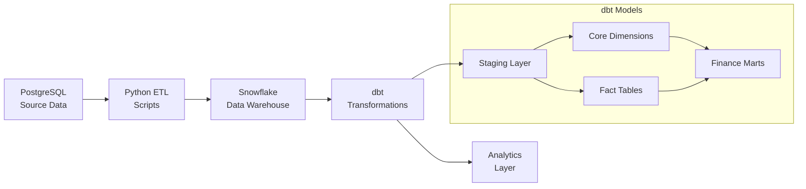

# E-commerce Data Warehouse with dbt

A comprehensive data engineering project that demonstrates a modern data stack with PostgreSQL, Snowflake, and dbt for building a production-ready e-commerce data warehouse.

## 🏗️ Architecture Overview



## 🚀 Quick Start

### Prerequisites

- Docker and Docker Compose
- PostgreSQL database (AlwaysData or local)
- Snowflake account
- Python 3.8+

### 1. Environment Setup

```bash
# Clone the repository
git clone https://github.com/Nihar-SANTOKI/ecommerce-data-warehouse
cd ecommerce-dbt-warehouse

# Copy environment template
cp .env.template .env

# Edit .env with your database credentials
vim .env
```

### 2. Database Setup

```bash
# Start Docker services
docker-compose up -d

# Setup PostgreSQL schema
docker-compose exec dbt python /scripts/setup_postgres.py

# Seed test data
docker-compose exec dbt python /scripts/seed_data.py

# Load data to Snowflake
docker-compose exec dbt python /scripts/loadDataToSnowflake.py
```

### 3. dbt Transformations

```bash
# Install dbt dependencies
docker-compose exec dbt dbt deps

# Run dbt transformations
docker-compose exec dbt dbt run

# Run tests
docker-compose exec dbt dbt test

# Generate documentation
docker-compose exec dbt dbt docs generate
docker-compose exec dbt dbt docs serve --host 0.0.0.0 --port 8080
```

### 4. Verify Pipeline

```bash
# Verify end-to-end data flow
docker-compose exec dbt python /scripts/verify_data_flow.py
```

## 📊 Data Models

### Source Layer
- **customers**: Customer master data
- **products**: Product catalog
- **orders**: Transactional order data

### Staging Layer (`staging/`)
- **stg_customers**: Cleaned customer data with surrogate keys
- **stg_products**: Standardized product data with profit calculations
- **stg_orders**: Order data with proper date formatting

### Core Layer (`marts/core/`)
- **dim_customers**: Customer dimension with tenure classification
- **dim_products**: Product dimension with price/profit tiers
- **dim_dates**: Calendar dimension with business date attributes
- **fact_orders**: Order fact table with calculated metrics

### Finance Layer (`marts/finance/`)
- **revenue_analysis**: Monthly revenue trends and growth metrics

## 🛠️ Available Commands

### Docker Management
```bash
docker-compose up -d               # Start all services
docker-compose down               # Stop all services  
docker-compose exec dbt bash      # Access dbt container shell
docker-compose logs -f            # View container logs
```

### Database Operations
```bash
docker-compose exec dbt python /scripts/setup_postgres.py      # Initialize PostgreSQL schema
docker-compose exec dbt python /scripts/seed_data.py           # Generate and load test data
docker-compose exec dbt python /scripts/loadDataToSnowflake.py # ETL from PostgreSQL to Snowflake
docker-compose exec dbt python /scripts/setup_snowflake.py     # Configure Snowflake schemas
```

### dbt Operations
```bash
docker-compose exec dbt dbt deps                               # Install dbt packages
docker-compose exec dbt dbt run                                # Run all models
docker-compose exec dbt dbt test                               # Run data quality tests
docker-compose exec dbt dbt docs generate                      # Generate documentation
docker-compose exec dbt dbt docs serve --host 0.0.0.0 --port 8080  # Serve documentation
docker-compose exec dbt dbt clean                              # Clean target directory
docker-compose exec dbt dbt debug                              # Debug connection issues
```

### Utilities
```bash
docker-compose exec dbt python /scripts/verify_data_flow.py    # End-to-end data verification
docker-compose exec postgres psql -U $POSTGRES_USER -d $POSTGRES_DB  # Verify PostgreSQL data
docker-compose exec dbt python /scripts/check_snowflake.py     # Verify Snowflake data
```

## 📈 Key Metrics & KPIs

The data warehouse provides insights into:

- **Revenue Analytics**: Monthly/quarterly revenue trends
- **Customer Segmentation**: Customer lifetime value and tenure
- **Product Performance**: Profit margins and price tier analysis
- **Order Analytics**: Order volume, average order value, growth rates

## 🏢 Business Value

### For Analysts
- Pre-built dimensional models for easy reporting
- Consistent business logic across all dashboards
- Historical trend analysis capabilities

### For Data Engineers  
- Modular, maintainable dbt codebase
- Comprehensive data quality testing
- Scalable architecture for additional data sources

### For Business Users
- Self-service analytics through clean, documented models
- Reliable, tested data for decision making
- Fast query performance with proper data modeling

## 📁 Project Structure

```
ecommerce-dbt-warehouse/
├── dbt_project/
│   ├── models/
│   │   ├── staging/          # Clean, standardized source data
│   │   └── marts/
│   │       ├── core/         # Dimensional models
│   │       └── finance/      # Business-specific marts
│   ├── tests/               # Custom data quality tests
│   ├── macros/              # Reusable SQL functions
│   └── dbt_project.yml      # dbt configuration
├── scripts/
│   ├── setup_postgres.sql   # Database schema
│   ├── seed_data.py         # Test data generation
│   ├── loadDataToSnowflake.py # ETL pipeline
│   └── verify_data_flow.py  # End-to-end testing
├── config/
│   ├── requirements.txt     # Python dependencies
│   └── profiles.yml.template # dbt profile template
├── docker/
│   └── Dockerfile          # Container definition
├── docker-compose.yml      # Multi-service orchestration
└── Makefile               # Automation commands
```

## 🔧 Configuration

### Database Connections

Edit `.env` with your database credentials:

```bash
# PostgreSQL (Source)
POSTGRES_HOST=your-postgres-host
POSTGRES_USER=your-username
POSTGRES_PASSWORD=your-password
POSTGRES_DB=your-database

# Snowflake (Data Warehouse)  
SNOWFLAKE_ACCOUNT=your-account
SNOWFLAKE_USER=your-username
SNOWFLAKE_PASSWORD=your-password
SNOWFLAKE_WAREHOUSE=COMPUTE_WH
SNOWFLAKE_DATABASE=ECOMMERCE_DW
SNOWFLAKE_SCHEMA=PUBLIC
SNOWFLAKE_ROLE=ACCOUNTADMIN
```

### dbt Profile

Configure `config/profiles.yml`:

```yaml
ecommerce_dw:
  target: snowflake
  outputs:
    postgres:
      type: postgres
      host: "{{ env_var('POSTGRES_HOST') }}"
      user: "{{ env_var('POSTGRES_USER') }}"
      password: "{{ env_var('POSTGRES_PASSWORD') }}"
      port: 5432
      dbname: "{{ env_var('POSTGRES_DB') }}"
      schema: public
      threads: 4
      keepalives_idle: 0

    snowflake:
      type: snowflake
      account: "{{ env_var('SNOWFLAKE_ACCOUNT') }}"
      user: "{{ env_var('SNOWFLAKE_USER') }}"
      password: "{{ env_var('SNOWFLAKE_PASSWORD') }}"
      role: "{{ env_var('SNOWFLAKE_ROLE') }}"
      database: "{{ env_var('SNOWFLAKE_DATABASE') }}"
      warehouse: "{{ env_var('SNOWFLAKE_WAREHOUSE') }}"
      schema: "{{ env_var('SNOWFLAKE_SCHEMA') }}"
      threads: 4
      client_session_keep_alive: False
      query_tag: dbt_ecommerce
```

## 🧪 Data Quality & Testing

The project includes comprehensive data quality checks:

- **Uniqueness tests** on primary keys
- **Not null tests** on critical fields  
- **Referential integrity** between fact and dimension tables
- **Custom business logic tests** for data consistency
- **Freshness tests** to ensure data is up-to-date

## 📚 Documentation

- **dbt docs**: Auto-generated model documentation with lineage
- **Business glossary**: Consistent metric definitions
- **Data catalog**: Column-level descriptions and business context

Generate and serve documentation:
```bash
docker-compose exec dbt dbt docs generate
docker-compose exec dbt dbt docs serve --host 0.0.0.0 --port 8080
# Opens browser to http://localhost:8080
```

## 🔍 Troubleshooting

### Common Issues

**Connection Errors**
```bash
# Debug dbt connections
docker-compose exec dbt dbt debug

# Check environment variables
docker-compose exec dbt env | grep SNOWFLAKE
```

**Missing Data**
```bash
# Verify data pipeline
docker-compose exec dbt python /scripts/verify_data_flow.py

# Check specific layer
docker-compose exec postgres psql -U $POSTGRES_USER -d $POSTGRES_DB  # Source data
docker-compose exec dbt python /scripts/check_snowflake.py          # Transformed data
```

**dbt Build Failures**
```bash
# Clean and rebuild
docker-compose exec dbt dbt clean
docker-compose exec dbt dbt deps
docker-compose exec dbt dbt run

# Run specific model
docker-compose exec dbt dbt run --models stg_customers
```

## 🚀 Advanced Usage Examples

### Full Pipeline Setup
```bash
# 1. Start services
docker-compose up -d

# 2. Setup databases
docker-compose exec dbt python /scripts/setup_postgres.py
docker-compose exec dbt python /scripts/seed_data.py
docker-compose exec dbt python /scripts/loadDataToSnowflake.py

# 3. Run dbt pipeline
docker-compose exec dbt dbt deps
docker-compose exec dbt dbt run
docker-compose exec dbt dbt test

# 4. Generate docs
docker-compose exec dbt dbt docs generate
docker-compose exec dbt dbt docs serve --host 0.0.0.0 --port 8080
```

### Development Workflow
```bash
# Make model changes, then:
docker-compose exec dbt dbt run --models modified_model
docker-compose exec dbt dbt test --models modified_model

# Or run everything with build command
docker-compose exec dbt dbt build
```

### Model-Specific Operations
```bash
# Run specific model with dependencies
docker-compose exec dbt dbt run --models +dim_customers

# Run downstream models
docker-compose exec dbt dbt run --models dim_customers+

# Compile without running
docker-compose exec dbt dbt compile

# Run tests for specific model
docker-compose exec dbt dbt test --models dim_customers
```

## 🤝 Contributing

1. Fork the repository
2. Create a feature branch: `git checkout -b feature/new-feature`
3. Make changes and test: `docker-compose exec dbt dbt test`
4. Commit changes: `git commit -am 'Add new feature'`
5. Push to branch: `git push origin feature/new-feature`
6. Submit pull request

## 📄 License

This project is licensed under the MIT License - see the [LICENSE](LICENSE) file for details.

## 🙏 Acknowledgments

- Built with [dbt](https://www.getdbt.com/) for data transformations
- Uses [Snowflake](https://www.snowflake.com/) as the cloud data warehouse
- Dimensional modeling principles from [Kimball Group](https://www.kimballgroup.com/)
- Data quality testing with [dbt-expectations](https://github.com/calogica/dbt-expectations)

---

**🔗 Links**:
- [dbt Documentation](https://docs.getdbt.com/)
- [Snowflake Documentation](https://docs.snowflake.com/)
- [Project Wiki](link-to-wiki)
