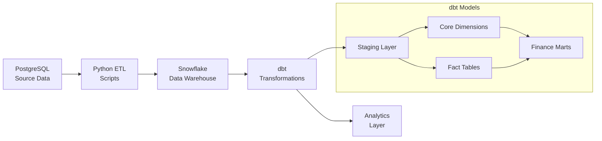

# E-commerce Data Warehouse with dbt

A comprehensive data engineering project that demonstrates a modern data stack with PostgreSQL, Snowflake, and dbt for building a production-ready e-commerce data warehouse.

## 🏗️ Architecture Overview



## 🚀 Quick Start

### Prerequisites

- Docker and Docker Compose
- PostgreSQL database (AlwaysData or local)
- Snowflake account
- Python 3.11+

### 1. Environment Setup

```bash
# Clone the repository
git clone <https://github.com/Nihar-SANTOKI/ecommerce-data-warehouse>
cd ecommerce-dbt-warehouse

# Copy environment template
cp .env.template .env

# Edit .env with your database credentials
vim .env
```

### 2. Database Setup

```bash
# Start Docker services
make docker-up

# Setup PostgreSQL schema
make setup-postgres

# Seed test data
make seed-data

# Load data to Snowflake
make load-snowflake
```

### 3. dbt Transformations

```bash
# Install dbt dependencies
make dbt-deps

# Run dbt transformations
make dbt-run

# Run tests
make dbt-test

# Generate documentation
make dbt-docs
```

### 4. Verify Pipeline

```bash
# Verify end-to-end data flow
make verify-pipeline
```

## 📊 Data Models

### Source Layer
- **customers**: Customer master data
- **products**: Product catalog
- **orders**: Transactional order data

### Staging Layer (`staging/`)
- **stg_customers**: Cleaned customer data with surrogate keys
- **stg_products**: Standardized product data with profit calculations
- **stg_orders**: Order data with proper date formatting

### Core Layer (`marts/core/`)
- **dim_customers**: Customer dimension with tenure classification
- **dim_products**: Product dimension with price/profit tiers
- **dim_dates**: Calendar dimension with business date attributes
- **fact_orders**: Order fact table with calculated metrics

### Finance Layer (`marts/finance/`)
- **revenue_analysis**: Monthly revenue trends and growth metrics

## 🛠️ Available Commands

### Docker Management
```bash
make docker-up          # Start all services
make docker-down        # Stop all services  
make docker-shell       # Access dbt container shell
make docker-logs        # View container logs
```

### Database Operations
```bash
make setup-postgres     # Initialize PostgreSQL schema
make seed-data          # Generate and load test data
make load-snowflake     # ETL from PostgreSQL to Snowflake
make setup-snowflake    # Configure Snowflake schemas
```

### dbt Operations
```bash
make dbt-deps          # Install dbt packages
make dbt-run           # Run all models
make dbt-test          # Run data quality tests
make dbt-docs          # Generate documentation
make dbt-clean         # Clean target directory
make dbt-debug         # Debug connection issues
```

### Utilities
```bash
make verify-pipeline   # End-to-end data verification
make check-postgres    # Verify PostgreSQL data
make check-snowflake   # Verify Snowflake data
```

## 📈 Key Metrics & KPIs

The data warehouse provides insights into:

- **Revenue Analytics**: Monthly/quarterly revenue trends
- **Customer Segmentation**: Customer lifetime value and tenure
- **Product Performance**: Profit margins and price tier analysis
- **Order Analytics**: Order volume, average order value, growth rates

## 🏢 Business Value

### For Analysts
- Pre-built dimensional models for easy reporting
- Consistent business logic across all dashboards
- Historical trend analysis capabilities

### For Data Engineers  
- Modular, maintainable dbt codebase
- Comprehensive data quality testing
- Scalable architecture for additional data sources

### For Business Users
- Self-service analytics through clean, documented models
- Reliable, tested data for decision making
- Fast query performance with proper data modeling

## 📁 Project Structure

```
ecommerce-dbt-warehouse/
├── dbt_project/
│   ├── models/
│   │   ├── staging/          # Clean, standardized source data
│   │   └── marts/
│   │       ├── core/         # Dimensional models
│   │       └── finance/      # Business-specific marts
│   ├── tests/               # Custom data quality tests
│   ├── macros/              # Reusable SQL functions
│   └── dbt_project.yml      # dbt configuration
├── scripts/
│   ├── setup_postgres.sql   # Database schema
│   ├── seed_data.py         # Test data generation
│   ├── loadDataToSnowflake.py # ETL pipeline
│   └── verify_data_flow.py  # End-to-end testing
├── config/
│   ├── requirements.txt     # Python dependencies
│   └── profiles.yml.template # dbt profile template
├── docker/
│   └── Dockerfile          # Container definition
├── docker-compose.yml      # Multi-service orchestration
└── Makefile               # Automation commands
```

## 🔧 Configuration

### Database Connections

Edit `.env` with your database credentials:

```bash
# PostgreSQL (Source)
POSTGRES_HOST=your-postgres-host
POSTGRES_USER=your-username
POSTGRES_PASSWORD=your-password
POSTGRES_DB=your-database

# Snowflake (Data Warehouse)  
SNOWFLAKE_ACCOUNT=your-account
SNOWFLAKE_USER=your-username
SNOWFLAKE_PASSWORD=your-password
SNOWFLAKE_WAREHOUSE=COMPUTE_WH
SNOWFLAKE_DATABASE=ECOMMERCE_DW
SNOWFLAKE_SCHEMA=PUBLIC
SNOWFLAKE_ROLE=ACCOUNTADMIN
```

### dbt Profile

Configure `config/profiles.yml`:

```yaml
ecommerce_dw:
  target: dev
  outputs:
    dev:
      type: snowflake
      account: "{{ env_var('SNOWFLAKE_ACCOUNT') }}"
      user: "{{ env_var('SNOWFLAKE_USER') }}"
      password: "{{ env_var('SNOWFLAKE_PASSWORD') }}"
      warehouse: "{{ env_var('SNOWFLAKE_WAREHOUSE') }}"
      database: "{{ env_var('SNOWFLAKE_DATABASE') }}"
      schema: public
```

## 🧪 Data Quality & Testing

The project includes comprehensive data quality checks:

- **Uniqueness tests** on primary keys
- **Not null tests** on critical fields  
- **Referential integrity** between fact and dimension tables
- **Custom business logic tests** for data consistency
- **Freshness tests** to ensure data is up-to-date

## 📚 Documentation

- **dbt docs**: Auto-generated model documentation with lineage
- **Business glossary**: Consistent metric definitions
- **Data catalog**: Column-level descriptions and business context

Generate and serve documentation:
```bash
make dbt-docs
# Opens browser to http://localhost:8080
```

## 🔍 Troubleshooting

### Common Issues

**Connection Errors**
```bash
# Debug dbt connections
make dbt-debug

# Check environment variables
docker exec -it ecommerce_dbt env | grep SNOWFLAKE
```

**Missing Data**
```bash
# Verify data pipeline
make verify-pipeline

# Check specific layer
make check-postgres  # Source data
make check-snowflake # Transformed data
```

**dbt Build Failures**
```bash
# Clean and rebuild
make dbt-clean
make dbt-deps
make dbt-run

# Run specific model
docker exec -it ecommerce_dbt dbt run --models stg_customers
```

## 🤝 Contributing

1. Fork the repository
2. Create a feature branch: `git checkout -b feature/new-feature`
3. Make changes and test: `make dbt-test`
4. Commit changes: `git commit -am 'Add new feature'`
5. Push to branch: `git push origin feature/new-feature`
6. Submit pull request

## 📄 License

This project is licensed under the MIT License - see the [LICENSE](LICENSE) file for details.

## 🙏 Acknowledgments

- Built with [dbt](https://www.getdbt.com/) for data transformations
- Uses [Snowflake](https://www.snowflake.com/) as the cloud data warehouse
- Dimensional modeling principles from [Kimball Group](https://www.kimballgroup.com/)
- Data quality testing with [dbt-expectations](https://github.com/calogica/dbt-expectations)

---

**🔗 Links**:
- [dbt Documentation](https://docs.getdbt.com/)
- [Snowflake Documentation](https://docs.snowflake.com/)
- [Project Wiki](link-to-wiki)
